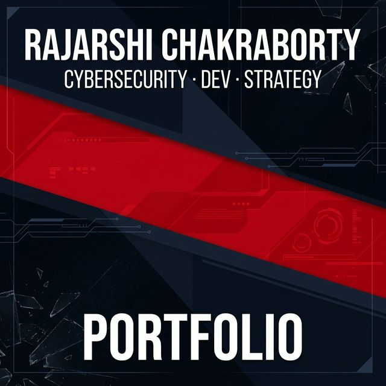

# Rajarshi Chakraborty | Persona 3 Themed Portfolio

Welcome to the source code for my interactive, highly stylized web portfolio, heavily inspired by the stunning user interface of the critically acclaimed video game *Persona 3 Reload*. 

This project aims to deliver a lightning-fast, visually striking experience that highlights my background in **Cybersecurity**, **Development**, and **Strategy**.



## 🌐 Live Website
**[https://persona-portfolio-website.vercel.app](https://persona-portfolio-website.vercel.app)**

## 🚀 Tech Stack
This project was built from the ground up for maximum visual flair and performance using:
- **React.js**
- **Vite** (for blazing fast build times and HMR)
- **Framer Motion** (for the buttery-smooth page transitions)
- **Vanilla CSS** (for all custom geometric clip-paths, text-strokes, and animations)

## 🛠️ Features
- **Dynamic Background Videos**: Utilizes incredibly optimized, hardware-accelerated `.mp4` background loops with zero-latency `.jpg` static posters.
- **Custom Gestures**: The website features a built-in event listener allowing navigation through traditional cursor clicks, keyboard arrays (`Arrow Keys`/`Enter`), or mobile swipe gestures (`Up`,`Down`,`Left`,`Tap`).
- **Fully Responsive**: Media queries elegantly re-scale the heavy UI elements for tablet and mobile screens without breaking the game's aesthetic.
- **Virtual Scrolling**: The certifications page intelligently renders lists without breaking the viewport's bounds.

## 💻 Local Installation

If you would like to run this site locally:

1. Clone the repository:
```bash
git clone https://github.com/X5464/Persona-Portfolio-website.git
cd Persona-Portfolio-website
```

2. Install the necessary dependencies:
```bash
npm install
```

3. Start the local development server:
```bash
npm run dev
```

4. Open your browser and navigate to `http://localhost:5173`.

## 🙌 Special Thanks & Credits
This project would not have been possible without the amazing foundational UI structure created by **moneybagg.py**. 

Massive thanks to them for laying down the structural styling and clip-path trickery that emulates the true *Persona* experience on the web. 

- Drop a follow on IG: **[@moneybagg.py](https://www.instagram.com/moneybagg.py/)**
- Check out their GitHub for more cool UI content!
